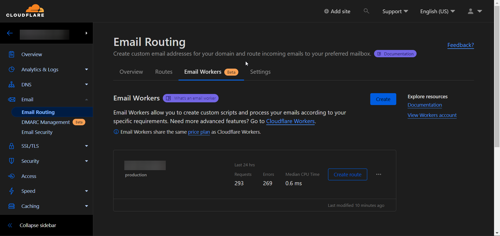
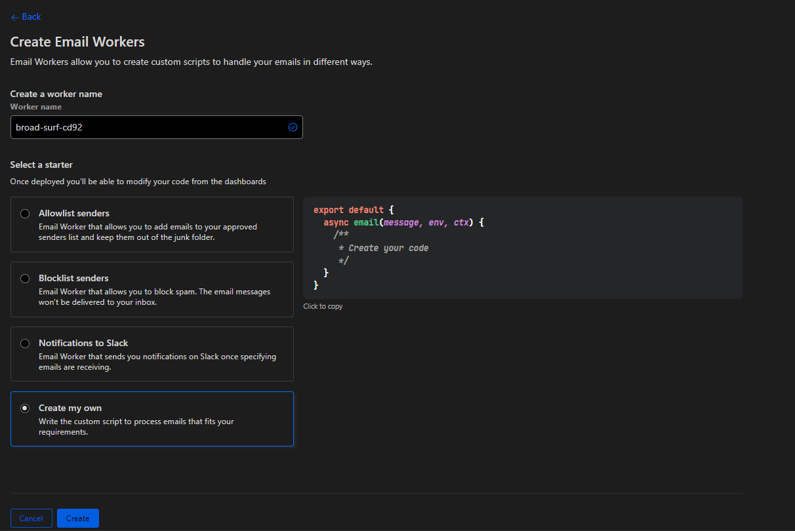
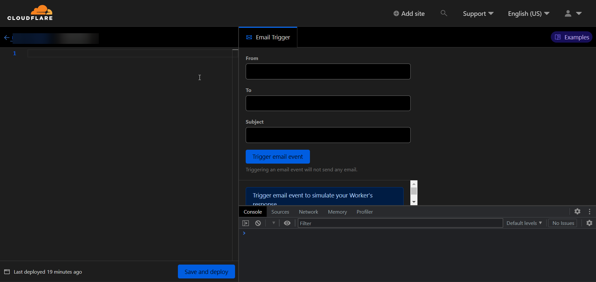

Today’s sunday, and you know what that means, more useless code to write😬. In this post I’ll be showing you how i use Cloudflare’s Email worker (which is currently still in beta) to forward emails to my LINE bot which you can find [here](https://github.com/radityaharya/line-bot),  

## Cloudflare Email Workers

Cloudflare Email Workers is a beta feature that allows you to programmatically interact with incoming email messages. Using Email Workers, you can forward, drop, or respond to email messages using your own custom logic.

To get started with Cloudflare Email Workers, the first thing you need is a domain registered with Cloudflare. Once you have a domain registered, you need to apply to the beta feature to gain access to Cloudflare Email Workers.



Oh and also you would also have to configure Email Routing through Cloudflare, which will apply MX records to your domain.



To make an email worker, you can click on the "Create" button, which will show a few examples that you can use. For this case, you can use the "Create my own" option.



Code Editor View

After clicking on the "Create" button, you will be taken to the Code Editor, where you can write your custom logic for processing incoming email messages.

## The Fun Part

This code snippet forwards the raw content of an email to an endpoint for further parsing. In this example, I forward emails to my Line Bot, but it can be used to post to other services such as Discord, Slack, etc.

```jsx
// https://developers.cloudflare.com/workers/runtime-apis/email-event/
// https://stackoverflow.com/questions/40385133/retrieve-data-from-a-readablestream-object/74237249#74237249

export default {
    async email(message, env, ctx) {
      const response = await fetch("https://[my relay endpoint]", {
        method: "POST",
        headers: {
          "Content-Type": "application/json",
          "SECRET_KEY": "[redacted]",
        },
        body: JSON.stringify({
          type: "mail-forward",
          to: "@me",
          content: {
            text: await new Response(message.raw).text(),
          },
        }),
      });
      console.log(response);
    },
  };
```

In this code snippet the **`message.raw`** property is a readable stream that contains the raw email message. The code reads the **`message.raw`** stream using the **`Response`** object and the **`text()`** method, which converts the stream into a string.

The code then sends a POST request to a relay endpoint, which in my case is an endpoint on my line bot that parses the email and sends it to me. It took me a while to understand how ReadableStream works but i eventually did 😵‍💫

This is just a simple example of how Cloudflare Email Workers can be used. There are many other possibilities that you can explore, such as filtering spam, creating autoresponders, routing emails based on context, and more. With Email Workers, you have the power to customize your email processing logic to fit your needs.

If you want to learn more about Cloudflare Email Workers or see more examples, you can check out the [official documentation](https://developers.cloudflare.com/email-routing/email-workers/). It's also worth noting that Email Workers is currently in beta, so there may be changes to the feature in the future.

