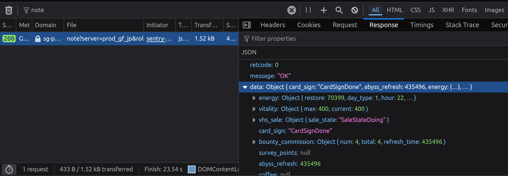
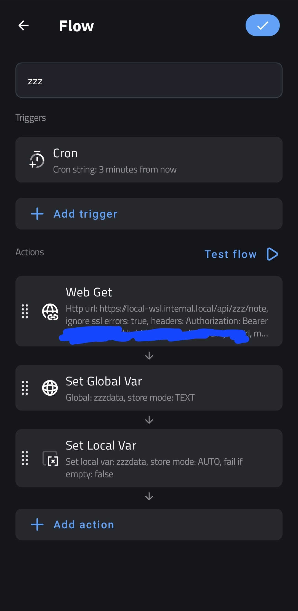
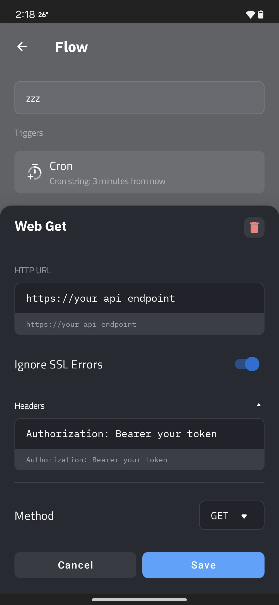
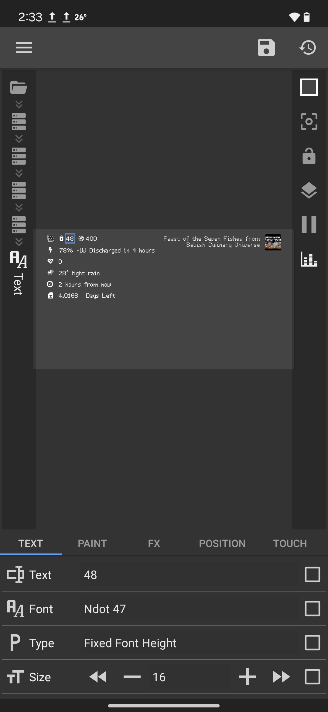

For this post, I'm switching things up a little to bring you a step-by-step guide on how to pull custom data for your KWGT widgets using APIs. Specifically, we'll customize a widget to show live updates from **Hoyolab** for HoYoverse's game **Zenless Zone Zero**. Ready to level up your Android home screen? Let's dive in.


## KWGT: What's the Big Deal?

[Get it on the Play Store!](https://play.google.com/store/apps/details?id=org.kustom.widget)

So, what even is KWGT? It stands for **Kustom Widget**, and it's basically the holy grail of Android widget customization. Think of it as a design studio for your home screen. Wanna throw in clocks, weather, or random motivational quotes into a slick design? KWGT's got you. Want to fetch live data and make your phone as cool as Tony Stark's HUD? KWGT makes it happen.

Here's why people are obsessed with it:
- You can freestyle widgets entirely from scratch.
- It supports dynamic data linking with external APIs, meaning live info can show up on your widget.
- Pair it with tools like **JSON parsing** or math operations, and you've got yourself a playground for creativity.

If that sounds intimidating—don't panic. I'll walk you through this as if we're figuring it out together.


## Why Custom Data?

By default, KWGT manages stuff like clocks, calendars, battery stats, and weather widgets—a solid start, sure, but nothing groundbreaking. However, when you tap into APIs—with just a little scripting magic—you can fetch **REAL data**, live and personalized. For instance, we can pull data from Hoyolab to show your game stats, or from Reddit to display top posts from your favorite subreddit.

Yes, Hoyolab has a dashboard and even their own widget, but where's the fun in that? With KWGT, you can design your own widget, exactly how you want it. Plus, it's a great way to learn about APIs and JSON parsing.

I'm using reverse engineering their web API to fetch data for this guide. If you're not into Zenless Zone Zero, you can apply the same steps to any API you like.


## Integrating the Hoyolab API with KWGT

### Setting Up the API

The first problem is finding the right API endpoint. For Hoyolab, it's not officially documented, but you can reverse engineer it from their web dashboard. Here's a sample endpoint for fetching **Zenless Zone Zero** battery count which you can get through the browser's developer tools:



```
https://sg-public-api.hoyolab.com/event/game_record_zzz/api/zzz/note
```

### Understanding the API Response

Finding the right endpoint is half the battle. The other half is understanding the API response. For Hoyolab, it's a JSON object with nested data. Here's a snippet of what you might get:

```json
{
  "retcode": 0,
  "message": "OK",
  "data": {
    "energy": {
      "progress": {
        "max": 240,
        "current": 44
      },
      "restore": 70399,
      "day_type": 1,
      "hour": 22,
      "minute": 35
    },
    "vitality": {
      "max": 400,
      "current": 400
    },
    "vhs_sale": {
      "sale_state": "SaleStateDoing"
    },
    "card_sign": "CardSignDone",
    "bounty_commission": {
      "num": 4,
      "total": 4,
      "refresh_time": 435496
    },
    "survey_points": null,
    "abyss_refresh": 435496,
    "coffee": null,
    "weekly_task": {
      "refresh_time": 435496,
      "cur_point": 300,
      "max_point": 1300
    }
  }
}
```

This JSON object contains various data points like energy, vitality, and weekly tasks, some might have different name from the one you are seeing in the dashboard, but you can correlate them by their values.

### Authenticating and Parsing

We technically could use this API as is in KWGT, but it's better to make our own aggregator API to handle authentication and parsing. This way, we can keep our API key secure and only expose the data we need.

I'm using a simple Bun + Hono.js server to handle this. You can view the code for the server [here](https://github.com/radityaharya/personal-api/tree/main/src/lib/zzz). 

Yes i over-complicated it a bit by using Zod, and stuff but it's a good practice to have a schema for your API.

For authentication, you can use the `Cookie` header and use it for every request you make to the Hoyolab API. You can get the cookie from the browser's developer tools.

### Securing Your API Endpoint

For my case, this endpoint is only accessible from my Tailscale network, but you can secure it further by using Hono's built-in authentication middleware which you can find [here](https://hono.dev/docs/middleware/builtin/bearer-auth).

Now, if we add any other Integrations, we can just add them to the same server and use the same authentication method.


### Hooking It Into KWGT

There are two ways to fetch data in KWGT: directly through the `wg()` in the formula editor or by using [Flows](https://docs.kustom.rocks/docs/reference/flows/). I prefer the latter because it's cleaner and easier to manage and gives flexibility on how and when it triggers.

In this guide, I wont be covering how kwgt basics work, but you can find the documentation [here](https://docs.kustom.rocks/docs/). Yes, it's quite daunting at first, but once you get the hang of it, it's quite easy.

Here's a simple flow to fetch the data from our API:

1. **Create a Basic Widget**: Start by creating a basic widget with a text element. This will be our placeholder for the data.
2. **Create a Flow**: Go to the `Flow` tab in the editor and create a new flow. Set the trigger to `Time` and set the interval to 5 minute.

Here are a few screenshots of how it looks:


3. **Add a Request**: Add a new request to the flow. Set the method to `GET` and the URL to your API endpoint. You can also add headers here if you need to.



4. **Storing to global variable**: Add a new action to the flow. Set the type to `Set Global Variable` and set the variable name to `zzz_data` and the store mode as "Text"

Now, we have the data stored in a global variable, we can use it in our widget.

5. **Display the Data**: Go back to the widget editor and set the text element's formula to any of the JSON data you want to display. For example, to display the current energy, you can use the formula: 

```php
$tc(json, gv(zzz_data, 0), ".data.energy.progress.current")$
```

explained:
- `tc` is the text converter function [tc](https://docs.kustom.rocks/docs/reference/functions/tc/)
- `json` is the type of conversion we want to do
- `gv` is the global variable function [gv](https://docs.kustom.rocks/docs/reference/functions/gv/). We pass variable name and a default value of 0
- `".data.energy.progress.current"` is the path to the data we want to display it follows the JSON object structure.

## You're All Set!

And that's it! You should be able to see the data from the Hoyolab API on your KWGT widget. If you're feeling adventurous, you can add more data points and maybe add other integrations to the same server.



## Why Stop Here?

Here's the best part about KWGT: once you've mastered API handling, you can go wild. Pull weather stats? Sure. Turn on and off your smart lights? Why not. Fetch your favorite subreddit's top posts? Absolutely. The possibilities are endless.